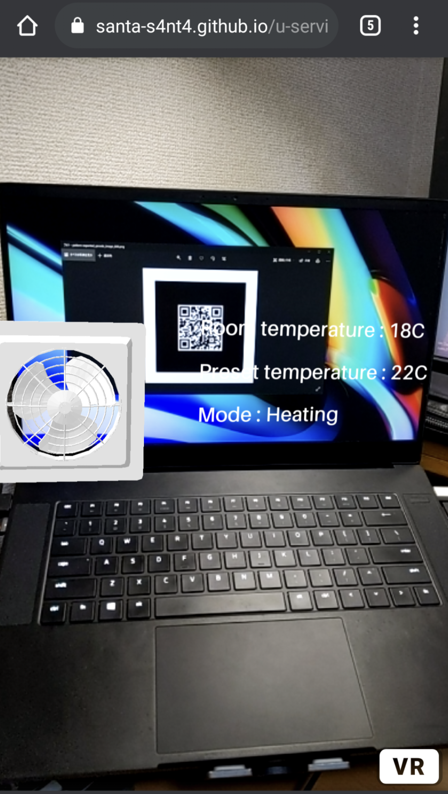

## 制作物
今回，私は家電情報を表示するARマーカーを制作した．問題意識として，自分の家で使っているGoogle HomeとNature Remoの使い勝手で日頃感じているかゆいところに手が届いていない部分を解消したいと思っていた．

その部分とは家電の情報がNature Remoのアプリを起動して，そこから各家電のアイコンをタップして情報を確認するというものである．私はこれをARを使ってスマホを家電にかざすことでその家電の情報を一覧するプロトタイプを制作した．また，これはエアコンを想定しているため，エアコンを一番想起できる3Dオブジェクトも配置した．

今回，自分の力不足でNature Remoから情報を読み取る部分を実装することはできなかったので仮で室内温度･設定温度･モードを表示してある．また，自分の理想としてはここから家電の設定を変更できるようにすることである．

## QR Code

このQRコードはマーカーにもなっている．

- [URL](https://santa-s4nt4.github.io/u-service20/)
- [GitHub](https://github.com/santa-s4nt4/u-service20)